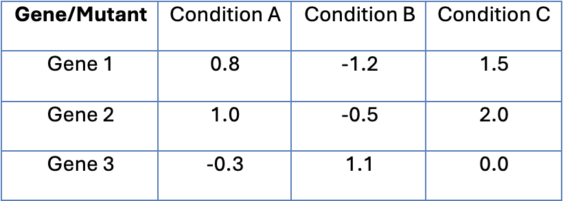

<p align="center">
  
</p>

___

**ChemGenXplore** is an interactive **Shiny** application designed for the visualisation and analysis of chemical genomic screens. This tool enables the exploration of gene- and condition-specific phenotypes, correlation analyses, and enrichment analyses, providing an intuitive platform for investigating large-scale chemical-genomic datasets.


___

## Introduction 

Chemical genomic screens are a valuable resource for uncovering gene functions and mapping biological pathways. However, their large-scale nature makes these datasets complex and challenging to interpret. ChemGenXplore addresses this challenge by simplifying access to these resources and providing researchers with an intuitive platform to explore and understand genotype-phenotype relationships across various species.


## Features

- **Phenotypic Visualisation**:
  - Explore gene- and condition-specific phenotypic scores through dynamic bar plots and interactive data tables.
  - Filter statistically significant phenotypes with an adjustable False Discovery Rate (FDR) threshold.

- **Correlation Analyses**:
  - Assess gene-gene and condition-condition correlations using Pearson’s correlation coefficient.
  - Filter for significant correlations exceeding ±0.4 with an adjustable FDR threshold.
  - Visualise positive and negative correlations for genes and conditions through interactive plots.
 
- **Enrichment Analysis**:
  - Perform Gene Ontology (GO) and KEGG pathway enrichment analyses for the *Escherichia coli* dataset.
  - Adjust the FDR threshold to refine enrichment results.
  - Visualise significant enrichment terms as interactive bar plots.

- **Interactive Heatmaps**:
  - Generate hierarchical heatmaps for gene-condition phenotypic scores.
  - Customise clustering with multiple methods (Complete, Single, Average, Ward D) and distance metrics (Euclidean, Manhattan, Maximum, Canberra).
  - Choose from multiple distance metrics (e.g., Euclidean, Manhattan) for clustering rows and columns.
  - Interact with heatmaps by zooming into specific regions.

- **Upload Your Own Dataset**:
  - Upload custom datasets formatted with genes as rows and conditions as columns. Example below:
    <p>
      
    </p>
    
  - Use the same phenotypic, correlation, enrichment, and heatmap analysis tools available for the E. coli dataset.

**All plots and data tables generated can be downloaded.**

## How to Run the App

1. Clone the repository:
   ```bash
   git clone https://github.com/Hudaahmadd/ChemGenXplore.git

## Data Sources
ChemGenXplore includes three pre-integrated, publicly available *Escherichia coli* datasets from chemical genomic screens. These datasets provide fitness scores across a wide range of conditions and serve as the foundation for the analyses performed in ChemGenXplore:

- Nichols et al., 2011: https://doi.org/10.1016/j.cell.2010.11.052
- Shiver et al., 2016: https://doi.org/10.1371/journal.pgen.1006124
- Price et al., 2018: https://doi.org/10.1038/s41586-018-0124-0

**Users also have the flexibility to upload their own datasets for analysis.**

## Acknowledgment

ChemGenXplore was developed with the support of The Banzhaf Lab and The Moradigaravand Lab.

- Institute of Microbiology and Infection, School of Biosciences, University of Birmingham, Birmingham, UK
- Biosciences Institute, Faculty of Medical Sciences, Newcastle University, Newcastle upon Tyne, UK
- Laboratory of Infectious Disease Epidemiology, KAUST Center of Excellence for Smart Health, Biological and Environmental Science and Engineering (BESE) Division, King Abdullah University of Science and Technology (KAUST), Thuwal, Saudi Arabia

With gratitude, I acknowledge the funding provided by The Darwin Trust of Edinburgh for my PhD studies.


## Contact 

For enquiries, please contact Huda Ahmad, Institute of Microbiology and Infection, School of Biosciences, University of Birmingham.


