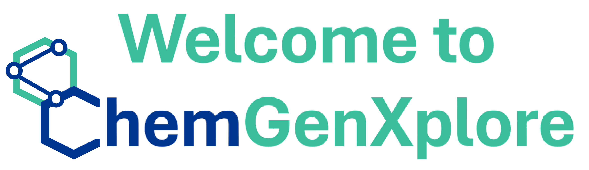
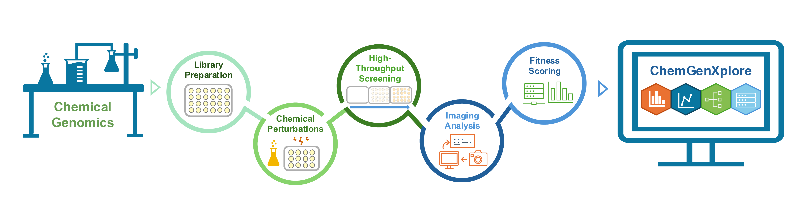

<p align="center">
  
</p>

<hr style="border: 0.5px solid;"/>

**ChemGenXplore** is an interactive **Shiny** application designed for the visualisation and analysis of chemical genomic screens. This tool enables the exploration of gene- and condition-specific phenotypes, correlation analyses, and enrichment analyses, providing an intuitive platform for investigating large-scale chemical-genomic datasets.



## Features
- **Phenotypic Visualisation**: Interactive plots for exploring gene- and condition-specific fitness scores.
- **Correlation Analyses**: Quantitative assessment of gene-gene and condition-condition correlations.
- **GO & KEGG Enrichment Analysis**: Functional enrichment analysis for the *Escherichia coli* dataset.
- **Customisable Heatmaps**: Clustering and distance metric options for hierarchical data exploration.
- **Downloadable Results**: Export plots and processed datasets for further computational analyses.

## How to Run the App

1. Clone the repository:
   ```bash
   git clone https://github.com/Hudaahmadd/ChemGenXplore.git

